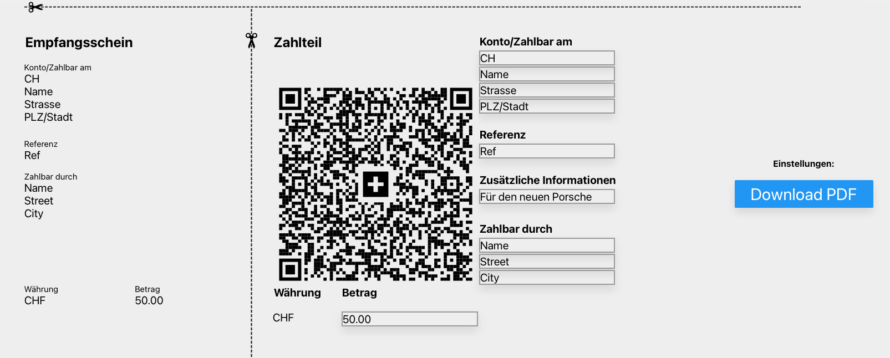

# Front-End Doc

### Invoice

Beim drücken auf den Knopf "Download PDF" sendet die Ract App einen **Post** request. 
Die **Json** Struktur sieht wie folgt aus. 

##### Request payload:
```
{
    "InvoiceInfo":
    {
        "Receiver_IBAN" : "",
        "Receiver_Name": "", 
        "Receiver_Street": "", 
        "Receiver_City": "", 
        "Receiver_Ref": "", 
        "AdditionalInfo": "",  
        "FromName": "",
        "FromStreet": "",
        "FromCity": "",
        "Amount": ""
    },
    "MetaData": 
    {
        "NumberOfPages" : 1
    }
}
```

##### Invoice View:

Das Invoice Modul besteht aus 10 Textfelder sowie einem Button. 



### Login

Bei drücken auf den "Login" Knopf auf der Startseite verschwindet das Invoice Modul und das Login Modul wird dargetstellt.

##### Request payload:
```

```

##### Invoice View:

Das Login Modul besteht aus 2 Textfelder sowie einem Button. 


### Preview

Ein Build der App kann unter dieser URL angeschaut werden. 
Preview [GitHub Pages](https://QRCodePreview.rothlin.com/).