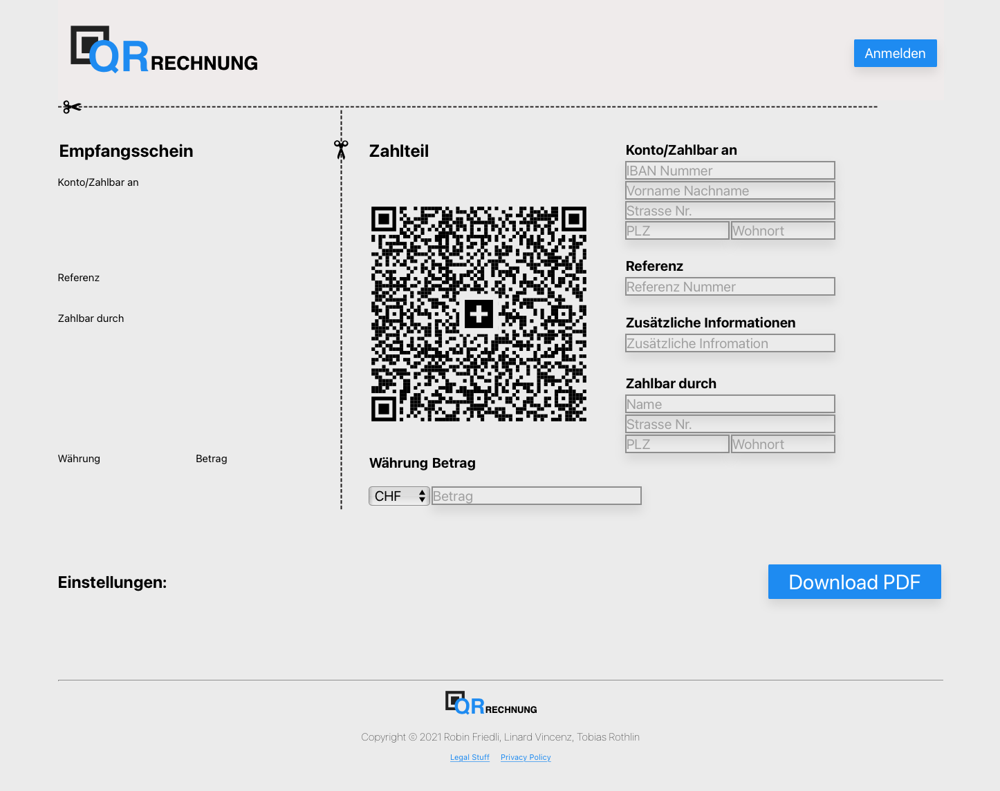
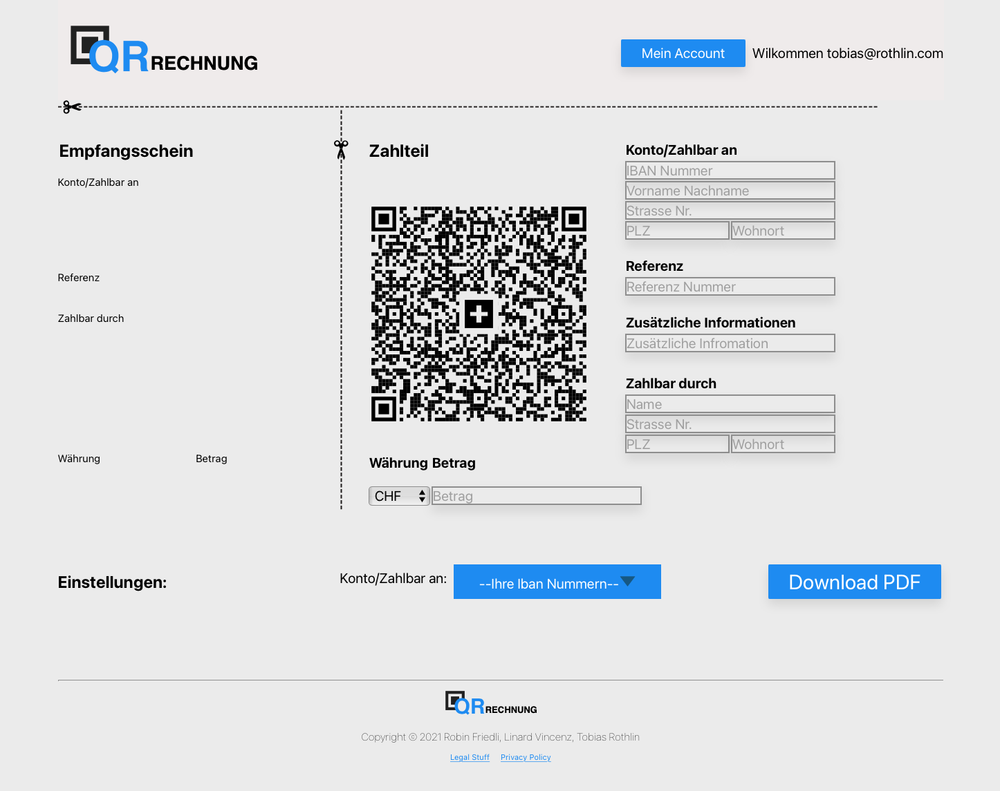
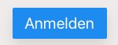
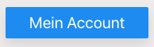
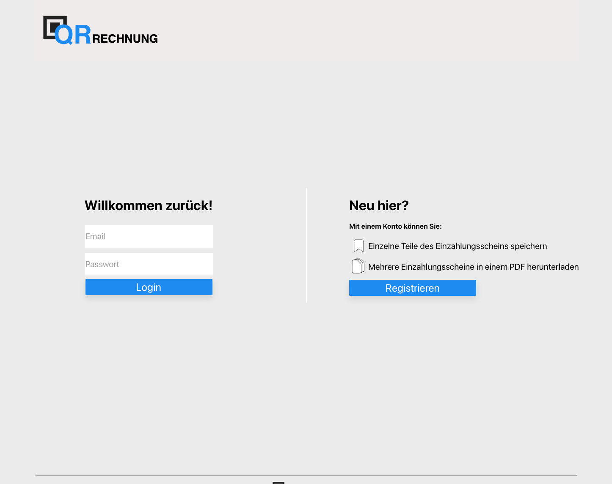
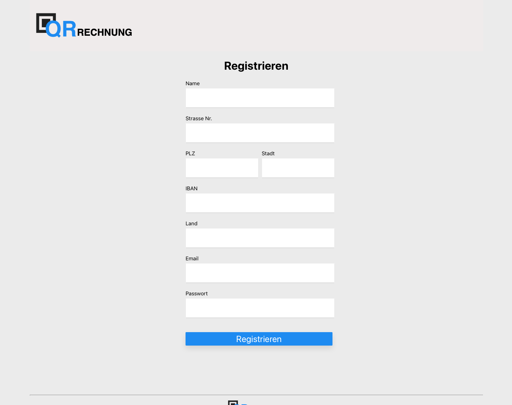
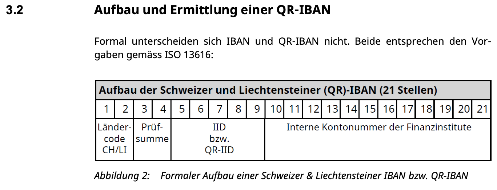
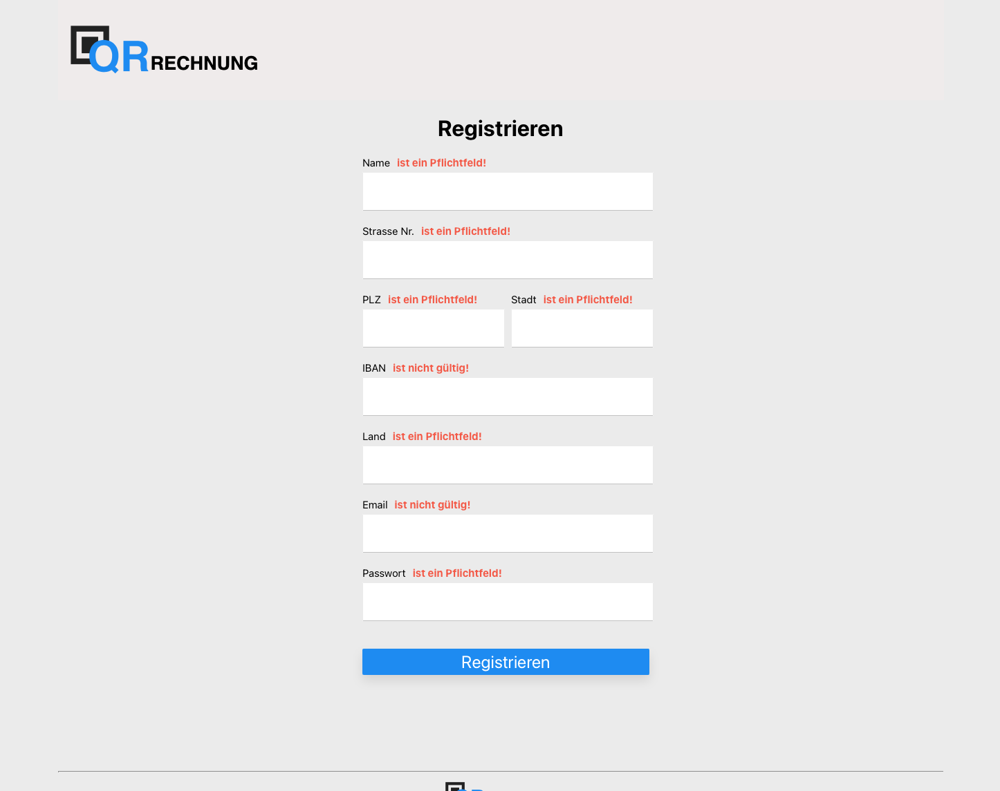
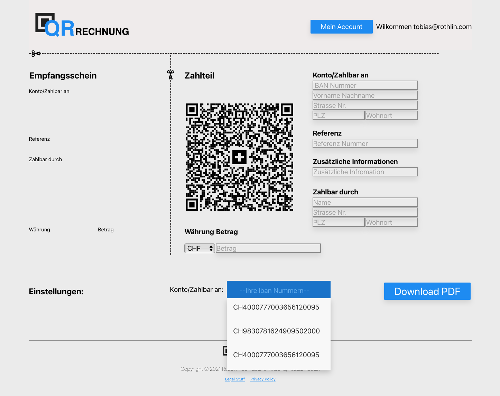
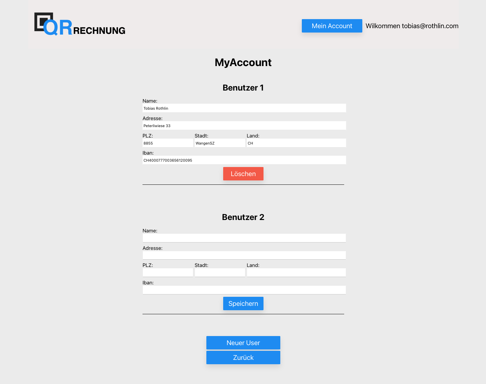

# Front-End Doc

The "QR Rechnung" React application is build to interact with the "QR Slip" Backend. The landing page shows a Swiss QR Rechnung.

## `App.js`

The `"App.js"` Component is the root component of the Application. It manages the state of the application. The application has basically two different states. The user is logged in or the User is not logged in. 

If the user is **not** logged in the page will look like this.

### `User not logged in:`



If the user **is logged in** the page will look like this.

### `User logged in:`


The App components contains three main React components. 

The `"Header.js"` component creates the header of the site. The header consists of the Logo


and a Button which depending on the state of the application is a **Login** or **MyAccount** button.




The `"Footer.js"`component creates the footer of the site. The footer consists of the **Logo**, the **Copyrights**, the **Privacy Policy** and some **Legal Stuff**.


The last component is dependent on the state of the site. It can be the `"Invoice.js"`, the `"Login.js"`, the `"Register.js"` or `"MyAccount.js"`. The current component is stores in the state of the App component. 

The state of this component contains the following:
````jsx
{
    currentPage: <Invoice></Invoice>,
    loginState : false,
    jwtToken: "",
    expirationTime : 0,
    userName : "",  
    showLogin : true,
    users:[]
}
````

#
## `Login.js`
The `"Login.js"` Page is nested in the App.js component within the currentPage state variable.



When the login page is shown the `"Header.js"` components only shows the logo. With a press on the logo the user can get page to the start page. 

On the Login page the user cna either Login in with an existing login or register a new Login. 

The `Email`field verifies the email if this is valid. When the login button is pressed the request is sent to the backend server and depending on the response the user will be logged in or and error text will be shown. 

If the user is logged in the `currentPage` state in the `"App.js"` component will be changed to the `"Invoice.js"`component. Also a interval function is called which will refresh the jwtToken in the interval specified in the login response.

If the user presses the "Registrieren" button the `currentPage` state in the `"App.js"` component will be changed to the `"Register.js"`component. 

#
## `Register.js`
The `"Register.js"` Page is nested in the App.js component within the currentPage state variable.



The `"Register.js"` has a very basic layout. There is minimal state dependency. If the user presses the "Registrieren" Button all fields will be verified. The fields **"Name"** , **"Strasse Nr."**, **"Stadt"**, **"Land"** and "**Passwort"** will just be check if the string has a length greater than 0. The field **"PLZ"** will only allow numbers up to a length of 4 digits to be entered and so also has only to be check it the length is greater than 0. 

To verified it the **"Email** field has an valid email. We use a regex vo check if the entered string is a email. 

The **"Iban"** verification is the most complicated one. This verification is used in every text field where the user has to enter an Iban number. While the user is typing all letters will automatically be written in capital letters and the string will be spaces with 4 characters together and a space between. if the string has a length of 26 Characters the user can't enter any more characters. And the verification function will be called. In this verification we only want to find typos in the Iban number. A Iban number has the follow patters. 




The first two digit number of the Iban number is the checksum. With this number we can verified the entire Iban number. The alogrythem to calculate the checksum is the MOD97. ([MOD97 description](https://usersite.datalab.eu/pantheonusermanual/tabid/316/language/en-us/topic/calculation-of-check-digits-according-to-modulus-97-10/htmlid/2261/default.aspx))

### `Problem with the MOD97 implementation in js`

As described in the [link](https://usersite.datalab.eu/pantheonusermanual/tabid/316/language/en-us/topic/calculation-of-check-digits-according-to-modulus-97-10/htmlid/2261/default.aspx) above after some rearranging the Iban number the algorithm has to divide the entire number by 97. The highest number which can be stored safely in js is 9'007'199'254'740'991 ( 2^53-1) even though this is a big number is is not even close to enough to store the Iban number as an *number*. The algorithm only cares for the remainder of the division the result will be a number between 0 and 96 which is definitely inside the number range of js. So to solve this division problem we implemented a string divider which divides each digit individually the same way a division by hand is made. The entire Iban verification runs in around 1.5ms.


If one of the field verifications fails the corresponding field will show a text which indicates the error.


If everything is valid the user will be registered on the backend and returned to the start page.


#
## `Invoice.js`

To make is as intuitive to fill out the Qr invoice we decided to show a Qr invoice in the UI.


All text fields have the save verifications as described in the Register section. The only new verification is if the reference number has to be entered or not. Depending on the Iban number a reference number has to be entered. And the correct reference type has to be encoded in the qr code. As described in this [pdf](https://www.paymentstandards.ch/dam/downloads/ig-qr-bill-de.pdf).

If the user is logged in a dropdown menu will be shown with all the uses saved Iban numbers which when pressed on will fill out the corresponding fields. (Iban, Name, Strasse, PLZ, Wohnort)


If the download button is pressed the form will be checked and the request will be send to the backend. The response pdf will be opened in a new window.

#
## `MyAccount.js`

The final modul is the `"MyAccoint.js"`. On this page the user can see all the users saved with his login. He can add new users and remove existing unsers. 
