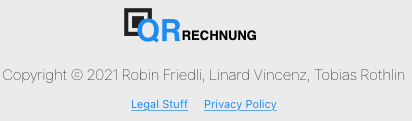

# Front-End Doc

The "QR Rechnung" React application is build to interact with the "QR Slip" Backend. The landing page shows a Swiss QR Rechnung.

## `App.js`

The `"App.js"` Component is the root component of the Application. It manages the state of the application. The application has basicl two diffrent states. The user is logged in or the User is not logged in. 

If the user is **not** logged in the page will look like this.

### `User not logged in:`


If the user **is logged in** the page will look like this.

### `User logged in:`


The App components contains three main React components. 

The `"Header.js"` component creates the header of the site. The header constists of the Logo


and a Button which depenting on the state of the application is a **Login** or **MyAccount** button.


The `"Footer.js"`component creates the footer of the site. The footer consists of the **Logo**, the **Copyrights**, the **Privacy Policy** and some **Legal Stuff**.



The last component is dependent on the state of the site. It can be the `"Invoice.js"`, the `"Login.js"`, the `"Register.js"` or `"MyAccount.js"`. The current commponent is stores in the state of the App component. 

The state of this component contains the folowing:
````jsx
{
    currentPage: <Invoice></Invoice>,
    loginState : false,
    jwtToken: "",
    experationTime : 0,
    userName : "",
    showLogin : true,
    users:[]
}
````

#
## `Login.js`

